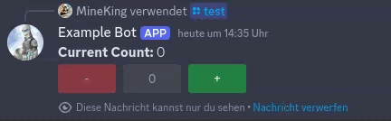
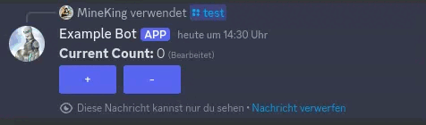
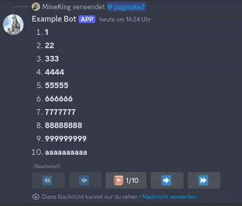

![[Kotlin CI]](https://github.com/MineKing9534/DiscordToolKit/actions/workflows/beta.yml/badge.svg)
![[Latest Version]](https://maven.mineking.dev/api/badge/latest/releases/de/mineking/DiscordToolKit?prefix=v&name=Latest%20Version&color=0374b5)

# Introduction
DTK ("Discord Tool Kit") is a library built around [JDA](https://github.com/discord-jda/JDA) that aims to simplify creating and handling application commands and user interfaces with message components or modals.
It also provides a built-in way to localize both commands and menus.

To create a DTK instance, you can use the `discordToolKit` function. As parameters, you have to pass your `JDA` instance and optionally an instance of the main class of your bot.
This is useful if you need already have a reference to the DTK instance available but also need access to your main class instance.
This is common in custom components or command implementations because they always provide a reference to their respective managers (Both CommandManager and UIManager have a reference to their DTK instance in the `manager` property).
If you don't provide an instance of your main class, `Unit` is used implicitly.

> [!NOTE]
> This library is not compatible with pure Java. If you want to use Java instead of Kotlin, you can take a look at [DiscordUtils](https://github.com/MineKing9534/DiscordUtils) which has a similar scope as this project but was created in and for Java.

There are some examples available in `src/test/kotlin/examples` if you want to see some features in action. If you want to run them you have to add the `-DTOKEN=<YOUR BOT TOKEN>` flag.

# Table of Contents
<!-- TOC -->
* [Introduction](#introduction)
* [Table of Contents](#table-of-contents)
* [Commands](#commands)
  * [Execution conditions](#execution-conditions)
  * [Options](#options)
    * [Packed and unpacked options](#packed-and-unpacked-options)
    * [Required and nullable options](#required-and-nullable-options)
    * [Option Mappers](#option-mappers)
    * [Configuring Options](#configuring-options)
    * [Choices and Autocomplete](#choices-and-autocomplete)
* [UI](#ui)
  * [States](#states)
  * [Menu Parameters](#menu-parameters)
  * [Defer Mode](#defer-mode)
  * [Message Menus](#message-menus)
    * [Components](#components)
      * [Buttons](#buttons)
      * [Selects](#selects)
      * [Layout](#layout)
    * [Submenus and Menu components](#submenus-and-menu-components)
    * [Pagination](#pagination)
    * [Text Builders](#text-builders)
  * [Modal Menus](#modal-menus)
  * [MenuCommand](#menucommand)
* [Localization](#localization)
  * [General](#general)
  * [Command Localization](#command-localization)
  * [Menu Localization](#menu-localization)
<!-- TOC -->

# Commands
To start using the CommandManager, you first have to register it to your DTK instance. You can then start configuring it inside the configuration block:
```kt
discordToolKit(jda).withCommandManager {
    //...
}.build()
```

You can register commands with either the `registerCommand` method, or simply use the `+` operator. To update your commands in discord, you can build an update request with the `updateCommands` method.
> [!NOTE]
> `updateCommands` returns a `RestAction` and does NOT automatically execute it. You still have to call `queue` on it like with other actions in JDA. 

```kt
discordToolKit(jda).withCommandManager {
    registerCommand(slashCommand("a") {
        //...
    })
    
    +slashCommand("b") {
        //...
    }

    updateCommands().queue()
}
```
You can create commands with `slashCommand` (For normal slash commands), `userCommand` (For user context commands) and `messageCommand` (For message context commands). You can define the name (and for slash commands the description) as parameters of these functions.
All further configuration can be done inside the configuration block. You can define default member permissions, integration type and interaction context types there. 
Defaults for integration type and interaction context types can be specified in the command manager config block.

You can also add subcommands to slash commands. This can be done by using the `+` operator inside the slash command config block with the command to use:
```kt
slashCommand("parent") {
    +slashCommand("subcommand_a") {
        //...
    }
  
    +slashCommand("subcommand_b") {
        //...
    }
}
```
You can also add multiple layers of subcommands. This will result in the creation of subcommand groups. However, you are still limited by the limitations of discord, meaning a command with subcommands cannot be executed.

You can specify the command body in an `execute` block. You can also define code that should be executed before the main executors. This can be used to define preconditions:
```kt
slashCommand("test") {
    before {
        //You can use terminateCommand to end command execution
        if (user.idLong != 0) terminateCommand()
    }
  
    execute {
        reply("Test").setEphemeral(true).queue()
    }
}
```
You can also specify whether before handlers should be inherited to subcommands (only relevant for slash commands because context commands cannot have children). 
Subcommands can also specifically ignore parent conditions by calling `ignoreParentConditions` in their config block.

## Execution conditions
If you want to use before handlers for conditions like in the example above, you can also use the `require` function. It can be used like this:
```kt
slashCommand("test") {
    require({ user.id == 0 }, orElse = { reply("You are not allowed to use this command").setEphemeral(true).queue() })
  
    execute {
        //Only executed if the condition above is met. Otherwise, the orElse handler is executed
    }
}
```

## Options
Slash commands can also have options. You can define them with the `option` function in the config of the respective slash command:
```kt
slashCommand("test") {
    val option = option<Int>("option", description = "Description")
  
    execute {
        reply("Response: ${option().orElse(0)}").setEphemeral(true).queue()
    }
}
```

Inside `execute` and `before` blocks, you can access an option's value by executing it as a function as seen above. The returned object contains the actual value of the option and whether it was provided or not (useful for non-required options).
You can use `orElse` to get the value of the option or the provided alternative if the option was not passed. Alternatively, you could also use `get` to directly get the provided value. However, this will throw an exception if the option was not provided and should therefore only be used for required options.

### Packed and unpacked options
You can also use `get` and `orElse` directly on the value returned by `option`:
```kt
slashCommand("test") {
    val option = option<Int>("option", description = "Description").orElse(0)
  
    execute {
        reply("Response: ${option()}").setEphemeral(true).queue()
    }
}
```
This might be more readable because the default value is defined directly next to the option declaration. You can also use `map`, `filter`, `orNull` and `or`. These are available both before and after getting the value (as seen above with `orElse`).

```kt
slashCommand("test") {
    val a = option<Int>("a").orElse(0).map { it + 1 }
    val b = option<Int>("b").filterValue { it != 0 }.orElse { a() } //orElse can also be used with a functional parameter providing access to the current SlashCommandContext. This allows you to make the default value dependent on e.g. the executor
    val c = option<Int>("c").orValue(a) //Use orValue here because the target option is unpacked already with orElse
  
    val d = option<Int>("d").mapValue { it + 1 } //Use mapValue because the contained value is still optional
    val e = option<Int>("e").or(d) //Use or directly because the target is already still optional
  
    execute {
        //These options return the raw type because they are mapped with unpacking options above
        val aValue: Int = a()
        val bValue: Int = b()
        val cValue: Int = c()
    
        //These options return OptionalOptions because they are only mapped without unpacking. You can still chain unpacking mappings above if you wanted to 
        val dValue: OptionalOption<Int> = d()
        val eValue: OptionalOption<Int> = e()
    }
}
```
The above example doesn't really make sense from a practical standpoint, but it demonstrates the different possibilities to handle options.

### Required and nullable options
Options are optional by default. You can either make them required by passing `required = true` as parameter or by using the overloads prefixed with required, e.g. `requiredOption<T>`. These will also directly return an unpacked option using `get`.
Similarly, there is also `nullableOption<T>` which will unpack the option using `orNull`, meaning the value will be null if no value was provided.

### Option Mappers
All option types are implemented using option mappers. These are used to specify how kotlin types should be used as discord functions and how to parse values from discord into kotlin objects. 
For all default types supported by discord, option mappers are already implemented and registered automatically. 
You can also define custom type mappers and add them to the `optionMappers` list in the command manager config block.

This would allow you to e.g. implement color options more easily:
```kt
optionMappers += nullSafeOptionMapper<Color, String>(OptionMappers.STRING, { _, _, _, _ -> setRequiredLength(7, 7) }) { value, type ->
    try {
        Color.decode(value)
    } catch (_: NumberFormatException) {
        //Required because this might also be executed from autocomplete
        if (this !is SlashCommandContext) return@nullSafeOptionMapper Color.BLACK
    
        reply("Invalid Color").setEphemeral(true).queue()
        terminateCommand()
    }
}

+slashCommand("test") {
    val option = option<Color>("option").orElse(Color.BLACK)
  
    execute {
        replyEmbeds(EmbedBuilder()
            .setColor(option())
            .setDescription("Test")
            .build()
        ).queue()
    }
}
```

### Configuring Options
For some default options types there are functions available for easier configuration:
```kt
slashCommand("test") {
  val a = option<Int>("a", configurator = { setMinValue(0); setMaxValue(10) })
  val b = intOption("b", min = 0, max = 10) //Shorter alternative
}
```
These are also available for other numeric types (`longOption`, `doubleOption`), string (for minLength and maxLength) and channel (for channel types).
All of these functions also have `required` and `nullable` variants available. 
If you have a type of option that you need multiple times, you can also define your own default option types by creating extension functions for `OptionConfig`.

### Choices and Autocomplete
You can pass a fixed set of choices to an option. A user has to select one of these choices (only possible for numeric types and strings):
```kt
slashCommand("test") {
    val option = option<String>("option", choices = listOf(
        choice("value", label = "label")
    ))
}
```

If you want to use autocomplete, you can simply pass a function as last argument. This will automatically mark the option as autocomplete and use the provided function as autocomplete handler:
```kt
slashCommand("test") {
    val option = option<String>("text") { replyChoices(
        autocompleteChoice(currentValue!!.uppercase())
    ) }
}
```

# UI
The UIManager allows to easily create both message and modal menus with the different available component types. 
These menus can store state values that are stored inside the component ids and are therefore persisted even when restarting your bot without requiring any additional database. 
To start using it, you have to register the UIManager to your DTK instance:
```kt
discordToolKit(jda).withUIManager {
    //...
}
```

Menus have to be registered once and can then be used afterwards:
```kt
discordToolKit(jda).withUIManager {
    val menu = registerMenu<Unit>("test") {
        //...
    }
    
    jda.getTextChannelById(0).sendMenu(menu).queue()
    //or
    jda.getTextChannelById(0).sendMenu(getMessageMenu("test")).queue()
}
```

At any point, you can use `terminateRender` to terminate the current render process. It can be used if you don't have any other way to manage complex render flows.

> [!NOTE]
> The following sections will contain information about a few default provided components, either directly mapping components supported by discord (buttons and selects) or more complex components that consist of multiple primitive components with predefined behavior.
> These are provided by default to make it easier to implement certain functionality, however, it would theoretically be possible to implement all of these yourself. 
> Therefore, if you don't like the behavior of a predefined component, you can look up its implementation and modify it to your needs.

## States
States allow you to store information in a menu that is persistent over different renders and even bot restarts. 
This is achieved by using the custom id space of your components to store state values (encoded as Cbor).

> [!TIP]
> You should therefore try to keep your component names rather short to leave more free space for states

In Message menus, the menu is automatically rerendered when state values change (after all handlers are executed). If you didn't change any state values but still want to rerender, you can call `forceUpdate`.

To declare a new state, you can simply use the `state` function. There are multiple ways to use the returned value:
- Delegation (Recommended)
```kt
var state by state(0)

//Read state value (Most commonly for component labels or content rendering)
println(state)

//Change state value (Most commonly inside component handlers)
state = 5
```
- Destructuring (Useful if you need the state reference to pass as a parameter to an advanced component)
```kt
val (state, setState, ref) = state(0)

//Read state value
println(state())

//Change state value
setState(5)
```
- Raw
```kt
val state = state(0)

//Read state value
println(state.get(this))

//Change state value
state.set(this, 5)
```

To pass a state reference to the counter component you could do
```kt
val (count, _, ref) = state(0)

content("**Current Count:** ${count()}")
+counter("counter", ref = ref)
```



Your state can be of any type, as long as it can be serialized and deserialized with Cbor. This means, that you can use custom types, as long as you define the serializers for that (See kotlin serialization documentation).
If you don't want to provide a default value, you can also use the following syntax:
```kt
val state by state<Int>()
```
This will make your state implicitly use `null` as default value and make the type of the returned state nullable as well.

You can also define state update handlers when declaring a state value. This is especially useful when passing a reference of your state to a component and for example want to update something in a database when the state value changes.
To do so you can simply pass a function as last parameter:
```kt
val state by state(0) { old, new -> pintln("Old: $old, New: $new") }
```
> [!NOTE]
> This update function is always called when a state update is triggered, regardless of whether the value actually changed.
> This means that setting the state value to the same value it had before will still cause your update handler to run.
> If you don't want this behavior, you can simply add an if-clause that checks whether the old and new values are equal

In some very rare cases you might want to create a state that always has the same value when read 
(therefore not an actual state that is stored somewhere but rather a constant value that is converted to a state and can be passed to a function that requires a state parameter).
You can use the `constantState` function for that. If your state also has to be writable you can use `sinkState`.
The state returned by this function will always implement WriteState as well as having the provided value when read. Calling `set` on this state (or doing anything that would change the state value) will be ignored.

You can use state transformations to store the state in a different format than when accessing it. For example if you want to store a color as int:
```kt
var color by state(0).transform({ Color(it) }, { it.rgb })

//...
color = Color.WHITE

//...
println(color.rgb)
```

## Menu Parameters
You might have noticed the `Unit` type parameter that is passed to registerMenu in the examples before. 
This type is the menu parameter type. In many cases you can just use Unit because you don't need a parameter, but you might want to pass certain information when first ending a menu, like an initial state value.

```kt
val menu = registerMenu<Int>("test") {
    var count by state(0)

    //The initialize block is only called when the menu is first sent and gives you access to the menu parameter
    initilaize { count = it }
    
    content("Count: $count")
    
    +button("inc", label = "+") { count++ }
}

//Send two menu instances, one with parameter 5 and one with parameter 10
jda.getTextChannelById(0).sendMenu(menu, 5).queue()
jda.getTextChannelById(0).sendMenu(menu, 10).queue()
```

## Defer Mode
Menu defer modes specify whether to automatically defer menu interactions. By default, all interactions are acknowledged directly after receiving the interaction (`DeferMode.ALWAYS`).
When an interaction is acknowledged, all components on the message are disabled until the menu is rerendered. This prevents "Application did not respond" problems when your rendering is taking too long.

However, this does not work when trying to reply with a modal in a component handler, because discord does not allow sending modals after an interaction was acknowledged.
If you need to do that, you can either change the defer mode to `DeferMode.NEVER` (Will never automatically defer interactions) or `DeferMode.UNLESS_PREVENTED` (Will defer after component handlers if you did not explicitly prevent the menu from rerendering with `preventUpdate`).

## Message Menus
Inside the menu configuration block you can register states, define the message content and components for the menu:
```kt
registerMenu<Unit>("test") {
    var count by state(0)
    
    content("Count: $count")
    
    +button("inc", label = "+") { count++ }
}
```
For more detailed information about states see [States](#states).
You can define the message content, embed and attachments with the corresponding functions. 

If you have resource heavy rendering, for example generating an image, you should write this code inside a `render` block. 
While the entire configuration block is executed several times, everything inside of `render` is only executed when the menu is currently rendering the message content:

```kt
registerMenu<Unit>("menu") {
    var state by state(0)
    
    render {
        //This code is only executed when the resulting message is actually used
        
        val image = generateImage(state) //Expensive render operation
        
        attachment(image)
    }
    
    //...
}
```

### Components
Components can be added with the `+` operator. There are some components available by default, but you can also write your own components, either from scratch with default configuration for default components or by composing multiple components to one.
The first parameter to every default component function is it's internal name. It has to be unique per menu and is used to match a component to its handler.

> [!NOTE]
> While all cosmetic properties of components like label etc. are allowed to change during different renders (e.g. by making it dependent on state values), the names and added components should stay the same during every call of the function.
> If you don't want to show certain components under certain conditions, you can use the `hide` function. This way the component is still added on each render but only actually shown on the message when you want to.

```kt
registerMenu<Unit>("test") {
    var count by state(0)
    
    content("**Current Count:** $count")
    
    +button("inc", label = "+", color = ButtonColor.BLUE) { count++ }
    +button("dec", label = "-", color = ButtonColor.BLUE) { count-- }

    //Only show reset button if the state value is not already 0
    +button("rst", label = "Reset", color = ButtonColor.RED) { count = 0 }.hide(count == 0)
}
```



Inside the handlers you can also access the interaction event:
```kt
button("btn", label = "Button") {
    println(event.user.name)
    println(user.name) //Same but shorter
}
```

The handler context also allows you to:
- Switch to another menu (You should prefer using switch menu components explained in [Submenus and Menu Components](#submenus-and-menu-components))
- Forcing the menu to rerender (Will only happen automatically if any state values change)
- Prevent the menu from rerendering (If you don't want to rerender even if some state values changed)
- Anything else you can do with the interaction event, like replying a new message

#### Buttons
You can create buttons with the `button` function. You can pass a label, emoji and color, next to the general name and handler. 
You can also use `link` to create a link button (Cannot have a handler or custom color).

There are also default implementations for `toggleButton` (toggles boolean state) and `enumToggleButton` (cycles through enum constants) available:
```kt
enum class Enum { A, B, C }

val (value, _, ref) = state(Enum.A)

+enumToggleButton("button", label = "${value()}", ref = ref)
```

#### Selects
You can create select menus with `stringSelect` or `entitySelect`. For string selects you also have to provide a list of `SelectOption`s (unless the menu is hidden or disabled).
A `SelectOption` can be created with the `selectOption` function. You can provide a value, label, emoji, description and whether the select option is selected by default. 
Additionally, you can also provide a handler that is called when the select option is selected:

```kt
stringSelect("select", min = 1, max = 2, options = listOf(
    selectOption("A", label = "A") { println("Option Handler A") }, //Option Handlers are called fist
    selectOption("B", label = "B") { println("Option Handler B") },
    selectOption("C", label = "C") //You don't have to provide an option handler
)) { //You can add a handler to the entire select (not required)
    println("Select Handler: " + event.values)
}
```

For string selects there are also stateful variants available. There is also `enumSelect` which also has stateful variants:
```kt
enum class Enum { A, B, C }

val ref = state(EnumSet.noneOf(Enum::class.java))
+statefulMultiEnumSelect<Enum>("select", ref = ref)
```

#### Layout
In some scenarios you might want to use a button as label, only showing some text but non-pressable. 
While you can achieve this by using a normal button and disabling it, this might be a little confusing to read.
Therefore, there is a `label` function available, that does that while having a more descriptive name.
Additionally, you can use the `blank` function to create an empty label, that can be used as spacer.

By default, the renderer tries to fit the components in order of addition in a single row and uses the next row once the first one is full (also works for select menus).
If you want to customize when a new action row is used, you can add the `endRow` component. 
This is a "virtual" component that does not actually display anything new but only forces the renderer to start a new action row.

### Submenus and Menu components
In a lot of scenarios you might want to have some sort of submenu, for example a sub-category for a configuration menu. 
While you could simply create a new root menu and switch between those, managing state manually would be rather complicated.

> [!CAUTION]
> The following is a negative example on how you could achieve submenus when you don't actually use the submenu feature.
> While this might be useful in some scenarios, doing this is very error-prone and should be avoided.

```kt
val menu = registerMenu<Unit>("menu") {
    var parentState by state(0)
    
    //...
    
    +button("child", label = "Child") { switchMenu(getMessageMenu("submenu")) {
        copyAll() //Copy all state values to the child menu
        pushDefaults() //USe default child state values for remaining state
        
        //copyAll(); pushDefaults() is the default state builder. So if you want to have this behavior you can also just not pass any value (See back button below)
        //You can also have more advanced state transfers. See examples below
    } }
}

registerMenu<Unit>("submenu") {
    skipState(1) //Increase internal state id counter to keep space for the parent menu states

    var childState by state(0)

    //...

    +button("back", label = "Back") { switchMenu(menu) }
}
```
The above example shows how the parent menu can switch to a different menu while still preserving the parent state. For example, changing the parent state to a value of 5, then going to the child menu, and then back again will keep the parent state at value 5.
This works because the parent state value is stored in the child state as well. If you want to have access to the parent state value inside the child menu you could do `val parent by state(0)` instead of `skipState(1)`.

However, this manual state transfer might be hard to read. Therefore, you can use the `submenu` function to create a submenu directly as child menu. This will manage some of this automatically:

```kt
registerMenu<Unit>("menu") {
    var parent by state(0)

    content("Parent: $parent")
    
    //Will be registered as `menu.submenu`
    val submenu = submenu("submenu") { back ->
        var child by state(0)
        
        content {
            +line("Parent: $parent")
            +line("Child: $child")
        }
        
        //Parent states are automatically inherited, and you can use the parent state accessors
        //All changes to parent states will be preserved when going back to the parent menu. Child states will be lost because they only exist in the child menu
        +button("p-inc", label = "Parent +") { parent++ }
        +button("c-inc", label = "Child +") { child++ }
        
        //The parameter provides an easy-to-read way to create a back button (
        +back.asButton("back", label = "Back")
    }
    
    +button("inc", label = "+") { parent++ }
    
    +button("child", label = "Child") { switchMenu(submenu) }
    +button("child5", label = "Child with value") { switchMenu(submenu) { copyAll(); push(5) } } //Use 5 as initial value for the child state
}
```

To make this work, the parent config also has to be executed on each child render. 
If you have expensive rendering in the parent, you can put it inside a `render` block. Parent render blocks will NOT be executed when rendering a child menu. Only states and localization context is inherited (See [Menu Localization](#menu-localization))

If you don't need the parent state values inside a submenu, but also need a lot of state space for child states, you can mark a submenu as detached (pass `detached = true` as parameter).
This will prevent the submenu from inheriting states from the parent. 
It also prevents the parent config to be executing when rendering the child, so it is also a way to avoid performance overhead if you experience any problems with that (Even though that shouldn't be a problem in most cases, provided you put expensive rendering inside a `render` block).

As seen above, submenus are often only used to be opened by a single component. To make this process even simpler, there are some components available that can combine some of the steps above:
```kt
registerMenu<Unit>("menu") {
    val submenu = submenu("submenu") { back ->
        //...
    }
    
    //Button that switches to the specified menu. Useful if you don't want to manually write the switchMenu handler but want to use the same submenu from different components (e.g. with different initial states). Also has an optional state builder parameter.
    +switchMenuButton(submenu, label = "Manual Submenu")
    
    //Combine submenu declaration and component for switching to it
    +menuButton("submenu-button", label = "Submenu Button") { back ->
        //You can do everything you can do in a submenu config (define states, use parent states, etc.)
        
        //...
    }
}
```
The most relevant components for this are `menuButton` and `menuSelectOption`.

You can find more examples in `src/test/kotlin/examples/ComplexMenu.kt`.

### Pagination
There are some functions available that simplify the process of creating paginated menus. 
To be more specific, there is a `pageSelector` component available, that allows users to freely switch between different pages. 
If you need a more specific kind of pagination, you have to implement that yourself. This can be achieved using a page state and conditional message content.
If your pages have strongly varying components, you can also consider creating submenus for your pages.

A very basic pagination can look like this:
```kt
registerMenu<Unit>("paginate", defer = DeferMode.UNLESS_PREVENTED) {
    val pageRef = state(1)
    var page by pageRef

    content(if (page == 1) "First Page" else "Second Page")

    +pageSelector("page", max = 2, ref = pageRef)
}
```


The button in the middle displays the current page and the page count. Clicking it opens a modal that allows to enter a page.
You can set the modal title and input label with the `title` and `label` parameters. To make this work, you have to set the defer mode to anything except `DeferMode.ALWAYS` because otherwise it would be impossible to reply with a modal.

In many cases you might want to list out a bunch of entries and paginate them into batches of a fixed size (e.g. to list a users collectibles):
```kt
//Example list of entries. Can also be generated inside the menu based on state
val entries = (0 until 100).map { it % 15 + 1 }.map { Character.forDigit(it, 16).toString().repeat(it) }

registerMenu<Unit>("paginate", defer = DeferMode.UNLESS_PREVENTED) {
    val page = state(1)
  
    //This function returns both the pageSelector component and the current batch of entries that should be renderer
    val (content, component) = pagination("page", entries.toList(), display = { index -> text("$index. ") + bold(this) }, perPage = 10, ref = page)

    content(content) //You could also use this as part of an embed description

    +component
}
```

This menu will paginate 100 entries on 10 pages: 

### Text Builders
discordToolKit provides a functional style message builder that allows you to create markdown formatted messages in a functional style. For example:
```kt
val data: MessageEditData = message {
    content {
        +h1("Heading")
        
        +line("Abc")
        +line {
            +bold("Abc: ")
            +text("**Automatically __escaped__ markdown**")
        }
        
        +raw("**Manual __Markdown__**\n")
        
        +sub("Subtext")
    }
    
    embed(embed {
        title("url")
        
        //Also supports description { ... } like content above
        description("description")
        
        //... other embed fields
        
        image("some url")
        
        //You can also directly add a buffered image. It will automatically be added as attachment:
        image(bufferedImage)
    })
}.build()
```

The main use case for this are message menus, because the `this` context in config blocks inherits from the message builder. 
This means, that the message content, embeds and attachments of message menus have to be configured like this.

> [!NOTE]
> If you don't like this style, you can still just use `content("<content>")`.

## Modal Menus
Modal menus represent discord modals. You can use `registerModal` to create a new modal menu:
```kt
registerModal<Unit>("modal") {
    //...
}
```

A simple modal with a single text input could be implemented like this:
```kt
registerModal<Unit>("modal") {
    val value = +textInput("text", label = "Text")
    
    execute {
        println(value())
    }
}
```

You can create text inputs with the `textInput` function. They can be added to your modal with the `+` operator. Adding a text input will return a function that can be used inside the executor block to read the inputs value.
The `execute` block is what is executed when a user submits a modal.

If you only want to use a modal to read a text input from the user in a message menu, you can use `modalButton` (or `modalSelectOption`):
```kt
registerMenu<Unit>("menu", deferMode = DeferMode.UNLESS_PREVENTED) {
    var name by state("")
    
    content("**Name:** $name")
  
    +modalButton("modal", label = "Change Name", title = "Enter Name", component = 
        textInput("name", label = "Your Name", value = name)
    ) { value ->
        name = value
    }
}
```
As always with modals, a menu that might open a modal has to use a defer mode other than `DeferMode.ALWAYS` (which is the default).

If you want to use a modal button with multiple inputs, you can combine multiple text inputs to a single modal component:
```kt
registerMenu<Unit>("menu", deferMode = DeferMode.UNLESS_PREVENTED) {
    var name by state("")
    
    content("**Name:** $name")

    +modalButton("modal", title = "Enter Name", component = composeInputs {
        val current = name.split(" ", limit = 2) 
        
        val first = +textInput("first", label = "First Name", value = current[0])
        val last = +textInput("last", label = "Last Name", value = if (current.size == 1) "" else current[1])

        produce { "${first()} ${last()}" }
    }) { value ->
        name = value
    }
}
```
You could also store the first name and last name in separate states by returning `listOf(first(), second())` in the producer and changing the rest of the code respectively.

As with message submenus, opening a modal with a `modalButton` will preserve all parent state values.

## MenuCommand
In most scenarios you want to send a menu as response to a command. To avoid having to register the menu separately in the ui manager configuration block or in a setup block of your command, and then replying with it manually, you can directly use a `menuCommand` that combines these steps:
```kt
menuCommand("menu") {
    var state by state(0)
    content("Count: $state")  
  
    +button("inc", label = "+") { state++ }
}
```
Inside the menu command config block you can configure both the menu (as seen above) and the command itself:
```kt
menuCommand("menu") {
    val option = option<Int>("option").get()
  
    before {
        //You can access option values inside before blocks.
        //These are executed before the menu is opened.
        //You can call terminateCommand to prevent anything after that to happen, including to open the menu
        
        if (option() == 0) terminateCommand()
      
        //However, you cannot initialize any state values in here because there is no menu yet during the runtime of this block.
        //Use initialize for that
    }

    initialize { context ->
        //The initialize block allows you to modify the state values of the menu before it is sent. 
        //You can also access option values here, however, you have to pass the parameter of this block as parameter to you option getter.
        
        state = option(context)
    }
  
    var optionState by option<Int>("state").orElse(0).createState()

    content("Count: $optionState")
    +button("inc", label = "+") { optionState++ }
}
```
You can define options as you would in a normal slash command (See [Options](#options) for more information). You can also create a state from an option using `createState`.
This will define a state will automatically be initialized with the value of the option. However, it is required that there is always a value available for the state, even during the builder phase.
If you have a non-required option (like above) and already provide a default value using `orElse`, this value will be used, and you are good to go. 
Otherwise, you have to provide a default value for the state as parameter in the `createState` method.

# Localization
Documentation not yet available, however there are some examples at `src/test/examples/LocalizedCommand.kt` and `src/test/examples/LocalizedMenu.kt` that should be enough to see the basic concept.

Inside localization lines, you can define custom scripts as `${ <arbitrary kotlin code> }`. This allows you to pass parameters to localization, but also more complex formatting. These scripts are compiled once they are registered, which is at startup for most cases.
This can take a short while (depending on hardware, amount, and complexity of your scripts) but doesn't affect the user experience as this delay only happens during registration and not while using the localization entries.

For automatic localization for commands and menus, localization keys are automatically generated based on their names. You can override those by passing strings to the respective fields, e.g. passing a string as command description in the builder.
If a value is provided, instead of localization, this value is used as literal. If you want to use it as the localization key, you can use the `localize` extension function for strings to mark it as localization key.

To use localization, you have to specify the file to read the localization from. The examples mentioned above show how to do that. You can also override the localization file for certain sub-parts like options or components by passing the file to use as the `localization` parameter.
This can be useful if you want to define a custom option that is used in several places. Using a custom localization allows you to define a global file to use for this option's localization instead of having to define its description in the localization of very respective command.

## General
## Command Localization
## Menu Localization